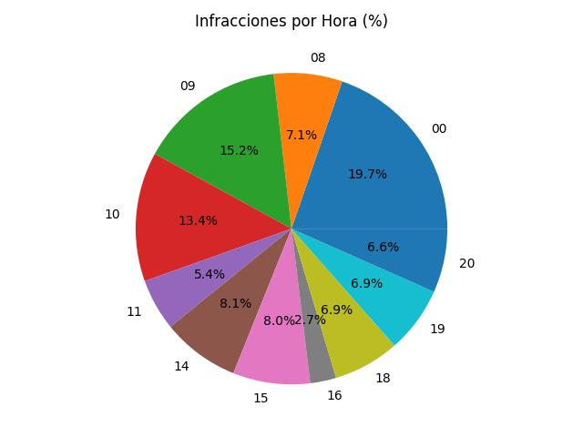
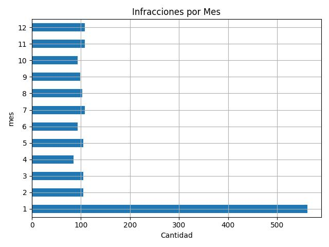

# Analisis e Interpretación

El dataset en su versión cruda contiene 4.000 registros de infracciones por exceso de velocidad provenientes de un sistema heredado sin procesos previos de validación. El análisis exploratorio reveló múltiples inconsistencias que imposibilitan identificar al infractor o la infracción en una parte significativa de los registros

Algunos de los casos encontrados:
- Formato de patentes inconsistentes o con caracteres no alfanuméricos
- Registros con fechas u horarios inválidos
- Registros sin velocidad registrada
- Patentes vacías 
- Radares inválidos

Se procedió a hacer un trabajo de normalización y limpieza de los datos, entre lo que se destaca

- Normalización de patentes y ubicación: se convirtieron a mayusculas y se les eliminó caracteres especiales.
- Estandarización de patentes: se consideraron aquellas con caracteres alfanumericos y dentro de un rango de 4 a 8 caracteres.
- Eliminación de registros outliers: aquellos registros anomalos con velocidades mayores o menores a una desviación estandar de 2σ se eliminaron.

> Nota: Para la detección de outliers en `velocidad_registrada` se optó por la regla de 2σ en lugar del criterio estándar de 3σ. Esta decisión se fundamenta en el contexto del dataset: al tratarse de infracciones registradas en zonas urbanas, aplicar 3σ produciría un límite inferior de aproximadamente 9 km/h y un límite superior de 183 km/h, rangos físicamente posibles pero estadísticamente poco útiles para identificar errores de captura. Con 2σ los límites son 38 km/h y 154 km/h, valores coherentes con las velocidades máximas permitidas en el dataset (40–80 km/h).

También se realizó una normalización de las fechas y horarios, en donde las fechas inválidas se las estandarizó bajo la fecha `1932-01-01`, y los horarios inválidos se procesaron bajó `00:00`. 

Si bien esta normalización permitió poder seguir trabajando con el dataframe, generó una sobrepresentación de las multas dentro de dichos valores de fecha y horario, lo cual es observable al momento de analizar los graficos representando los porcentajes de infracciones por hora:



O cantidad de infracciones por mes



De la cantidad total del dataset procesado, se observa que un total del 26.54% de los registros marcan infracciones dentro de la fecha 1932-01-01 y un total del 19.73% dentro del horario 00:00h lo cual distorsiona los gráficos de distribución por mes y por hora si no se contempla explícitamente

# Conclusión

Esta sobrerrepresentación expone una limitación importante del proceso: la normalización con valores predeterminados resuelve el problema técnico pero introduce sesgo analítico. Una mejora posible podría consistir en marcar los registros inválidos antes de aplicar el reemplazo, permitiendo excluirlos selectivamente en los análisis visuales sin necesidad de eliminarlos del dataset procesado.

En definitiva, la calidad del análisis no depende únicamente de la limpieza de los datos, sino de la capacidad de identificar las consecuencias de cada decisión de normalización y reflejarlas en la interpretación de los resultados.


# Hallazgos sobre los datos

El sistema de radares tiene cobertura visual parcial: del total de 1673
multas válidas, solo el 41% (691) tiene evidencia visual; el 59% restante
(982) son infracciones registradas sin foto de respaldo. Esto plantea un
problema operativo: si el infractor contesta la multa, la única prueba
disponible es el registro administrativo del radar.

El caso es más crítico en las multas pendientes de pago (IMPAGA): de las
418 existentes, solo 161 (39%) cuentan con foto. Las 257 restantes son las
más vulnerables a una apelación exitosa.

Del lado del dataset de imágenes, de 108 fotos procesadas solo 27 (25%)
lograron asociarse a una multa real. El 75% restante puede deberse a:
vehículos fotografiados sin infracción válida, errores del OCR sobre esa
imagen, o patentes de otra jurisdicción que no figuran en este CSV.

# Decisiones técnicas y trade-offs

Dos decisiones de implementación impactaron significativamente en los resultados finales:

1. **OCR sobre escala de grises (no color)**: se comparó el rendimiento de `extraer_patente` sobre las imágenes originales en color contra las versiones en escala de grises del Ej. 03, y la versión en gris obtuvo notablemente más matches. easyocr parece tolerar mejor el contraste reducido del gris, especialmente en patentes pequeñas o de baja calidad.
    
2. **`SequenceMatcher` en vez de comparación posición a posición**: easyocr lee TODO el texto visible en la imagen (eslóganes, ciudad de origen, modelo del auto), no solo la patente. El resultado es que muchas extracciones devuelven la patente embebida dentro de un string mucho más largo, por ejemplo:
    
    ```
    WASHINGTONEMOT IONevergreen stat
    Jay"chslov a"[HAMSTUR
    @ 0OEnoSadASA
    BELIZE CAC26727BELIZE CITY
    ```
    
Una comparación literal carácter a carácter de izquierda a derecha falla en estos casos: aunque la patente real esté presente en la cadena, queda desplazada respecto al inicio y el ratio se reduce a ≈ 0. Por eso se decidió usar `difflib.SequenceMatcher` (stdlib de Python), que busca la subsecuencia común más larga entre dos cadenas. Esto permite encontrar la patente "escondida" dentro del texto ruidoso y reportar un ratio representativo. Esta sola decisión casi triplicó la cantidad de matches respecto al algoritmo posicional.
